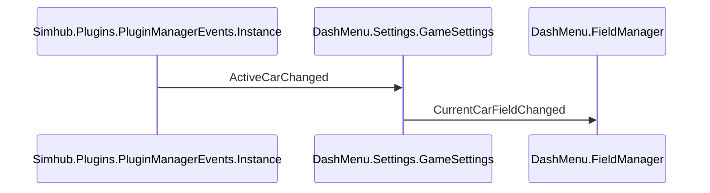
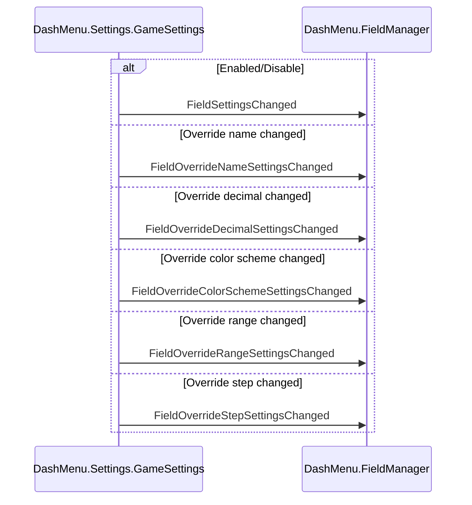
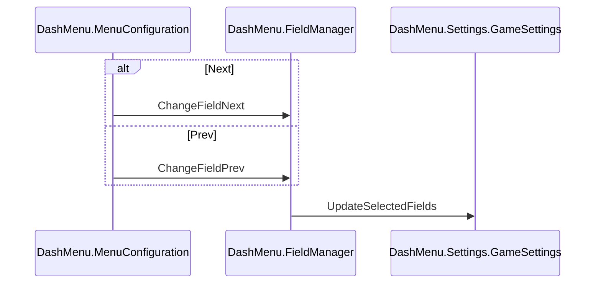
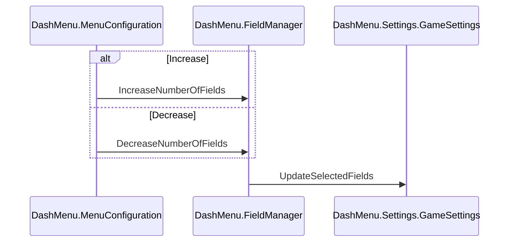

# Sequence Diagram

Event call sequence when car is changed.

```mermaid
    sequenceDiagram

    participant PluginManagerEvents As Simhub.Plugins.PluginManagerEvents.Instance
    participant GameSettings As DashMenu.Settings.GameSettings
    participant FieldManager As DashMenu.FieldManager

    PluginManagerEvents ->> GameSettings : ActiveCarChanged
    GameSettings ->> FieldManager : CurrentCarFieldChanged
```

Field settings changed from the UI.

```mermaid
    sequenceDiagram

    participant GameSettings As DashMenu.Settings.GameSettings
    participant FieldManager As DashMenu.FieldManager

    alt Enabled/Disable
        GameSettings ->> FieldManager : FieldSettingsChanged
    else Override name changed
        GameSettings ->> FieldManager : FieldOverrideNameSettingsChanged
    else Override decimal changed
        GameSettings ->> FieldManager : FieldOverrideDecimalSettingsChanged
    else Override color scheme changed
        GameSettings ->> FieldManager : FieldOverrideColorSchemeSettingsChanged
    else Override range changed
        GameSettings ->> FieldManager : FieldOverrideRangeSettingsChanged
    else Override step changed
        GameSettings ->> FieldManager : FieldOverrideStepSettingsChanged
    end
```

Displayed fields changed.

```mermaid
    sequenceDiagram

    participant MenuConfiguration As DashMenu.MenuConfiguration
    participant FieldManager As DashMenu.FieldManager
    participant GameSettings As DashMenu.Settings.GameSettings

    alt Next
        MenuConfiguration ->> FieldManager : ChangeFieldNext
    else Prev
        MenuConfiguration ->> FieldManager : ChangeFieldPrev
    end
    FieldManager ->> GameSettings : UpdateSelectedFields
```

Increase or decrease number of fields.

```mermaid
    sequenceDiagram

    participant MenuConfiguration As DashMenu.MenuConfiguration
    participant FieldManager As DashMenu.FieldManager
    participant GameSettings As DashMenu.Settings.GameSettings

    alt Increase
        MenuConfiguration ->> FieldManager : IncreaseNumberOfFields
    else Decrease
        MenuConfiguration ->> FieldManager : DecreaseNumberOfFields
    end
    FieldManager ->> GameSettings : UpdateSelectedFields
```
