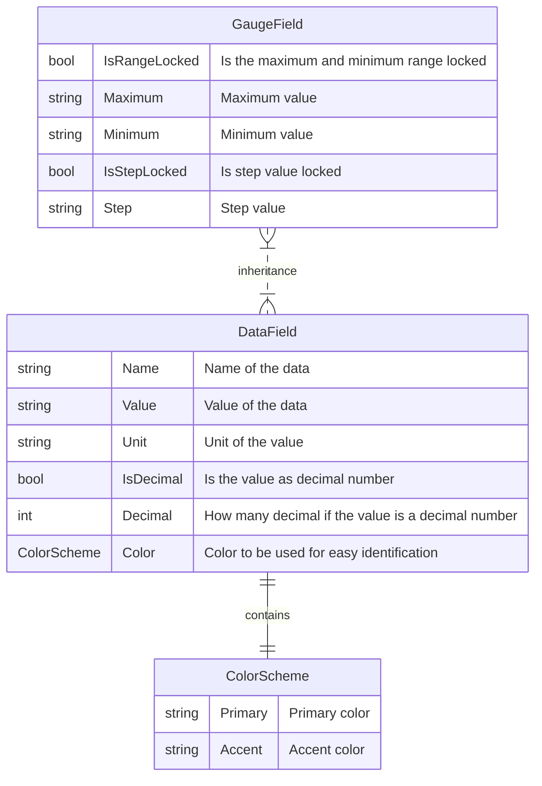

# Make your own extension fields

The following examples demonstrate how to create basic extension data fields for use within the `DashMenuPlugin` system. Each extension field includes a description, data/gauge field, name, color scheme, and an update method that is called on every game tick.



## Example 1: Basic Extension Field

This example creates a simple traction control (TC) level field. That also is an alert.

```C#
using DashMenu.Data;
using GameReaderCommon;
using SimHub.Plugins;

namespace CommonExtensionFields
{
    public class TCLevel : AlertBase, IDataFieldExtension
    {
        public TCLevel(string gameName) : base(gameName)
        {
            Data = new DataField()
            {
                Name = "TC",
                Color = new ColorScheme("#00a3d9")
            };
            Data.PropertyChanged += DataAlert_PropertyChanged;
        }

        public string Description => "TC Level.";

        public void Update(PluginManager pluginManager, ref GameData data)
        {
            if (!data.GameRunning) return;
            if (data.NewData.TCLevel < 0)
            {
                Data.Value = "-";
                return;
            }
            Data.Value = data.NewData.TCLevel.ToString();
        }
    }
}
```

## Example 2: Decimal Number Field

This example creates a throttle position field, which can represent decimal numbers.

```c#
using DashMenu.Data;
using GameReaderCommon;
using SimHub.Plugins;

namespace CommonExtensionFields
{
    public class Throttle : FieldExtensionBase<IGaugeField>, IDataFieldExtension, IGaugeFieldExtension
    {
        public Throttle(string gameName) : base(gameName)
        {
            Data = new GaugeField()
            {
                Name = "THR",
                IsDecimalNumber = true,
                Decimal = 0,
                Unit = "%",
                Color = new ColorScheme(),
                IsRangeLocked = true,
                Maximum = 100.ToString(),
                Minimum = 0.ToString()
            };
        }

        public string Description => "Throttle position.";

        IDataField IFieldExtensionBasic<IDataField>.Data { get => Data; set => Data = (IGaugeField)value; }

        public void Update(PluginManager pluginManager, ref GameData data)
        {
            if (!data.GameRunning) return;
            Data.Value = DecimalValue(data.NewData.Throttle);
        }
    }
}
```

## Example 3: Field with Unit

This example creates a water temperature field, which includes a unit derived from SimHub's settings. This example is also a gauge field. A gauge field will also be added in the plugin as a data field.

```c#
using DashMenu.Data;
using GameReaderCommon;
using SimHub.Plugins;

namespace CommonExtensionFields
{
    public class WaterTemperature : FieldExtensionBase<IGaugeField>, IDataFieldExtension, IGaugeFieldExtension
    {
        public WaterTemperature(string gameName) : base(gameName)
        {
            Data = new GaugeField()
            {
                Name = "WT",
                IsDecimalNumber = true,
                Decimal = 0,
                Color = new ColorScheme(),
                Maximum = 100.ToString(),
                Minimum = 20.ToString()
            };
        }

        public string Description => "Water temperature.";

        IDataField IFieldExtensionBasic<IDataField>.Data { get => Data; set => Data = (IGaugeField)value; }

        public void Update(PluginManager pluginManager, ref GameData data)
        {
            if (!data.GameRunning) return;
            if (data.NewData.WaterTemperature <= 0)
            {
                Data.Value = "-";
                return;
            }
            Data.Value = DecimalValue(data.NewData.WaterTemperature);
            Data.Unit = "°" + data.NewData.TemperatureUnit[0];
        }
    }
}
```

## Example 4: Gauge field that also is an alert

```c#
using DashMenu.Data;
using GameReaderCommon;
using SimHub.Plugins;
using System;
using System.ComponentModel;

namespace CommonExtensionFields
{
    public class BrakeBias : FieldExtensionBase<IGaugeField>, IDataFieldExtension, IGaugeFieldExtension, IAlert
    {
        public BrakeBias(string gameName) : base(gameName)
        {
            Data = new GaugeField()
            {
                Name = "BB",
                IsDecimalNumber = true,
                Decimal = 1,
                Color = new ColorScheme("#d90028"),
                IsRangeLocked = true,
                Maximum = 100.ToString(),
                Minimum = 0.ToString()
            };
            Data.PropertyChanged += DataAlert_PropertyChanged;
        }

        private void DataAlert_PropertyChanged(object sender, PropertyChangedEventArgs e)
        {
            if (!(sender is IDataField)) return;
            switch (e.PropertyName)
            {
                case nameof(IDataField.Value):
                    EndTime = DateTime.Now + ShowTimeDuration;
                    break;
                default:
                    break;
            }
        }

        public string Description => "Brake bias.";

        IDataField IFieldExtensionBasic<IDataField>.Data { get => Data; set => Data = (IGaugeField)value; }

        IDataField IAlert.Data { get => Data; set => Data = (IGaugeField)value; }

        public void Update(PluginManager pluginManager, ref GameData data)
        {
            if (!data.GameRunning) return;
            if (data.NewData.BrakeBias < 0)
            {
                Data.Value = "-";
                return;
            }
            Data.Value = data.NewData.BrakeBias.ToString($"N{Data.Decimal}");
        }

        public bool Show { get => DateTime.Now < EndTime; }

        public TimeSpan ShowTimeDuration { get; set; } = TimeSpan.Zero;

        public DateTime EndTime { get; protected set; } = DateTime.Now;
    }
}
```
