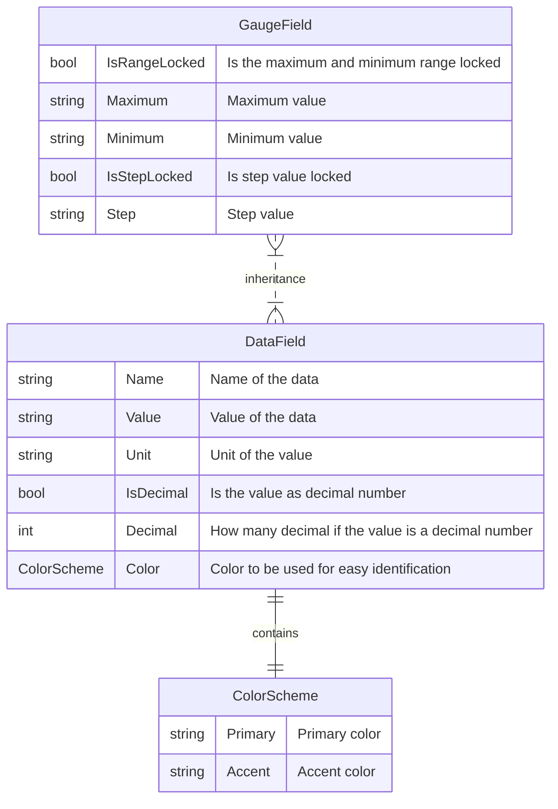
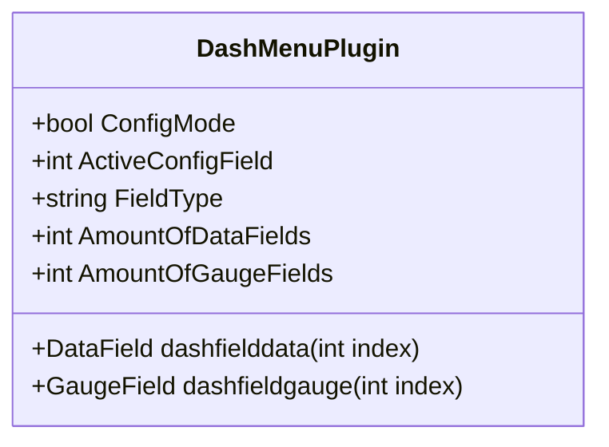

# Make your own extension fields

The following examples demonstrate how to create basic extension data fields for use within the `DashMenuPlugin` system. Each extension field includes a description, data/gauge field, name, color scheme, and an update method that is called on every game tick.



## Example 1: Basic Extension Field

This example creates a simple traction control (TC) level field.

```C#
using DashMenu.Data;
using GameReaderCommon;

namespace CommonExtensionFields
{
    public class TCLevel : FieldExtensionBase, IDataFieldComponent
    {
        public TCLevel(string gameName) : base(gameName) { }
        public string Description { get => "TC Level."; }
        public IDataField Data { get; set; } = new DataField()
        {
            Name = "TC",
            Color = new ColorScheme("#00a3d9", "#ffffff")
        };
        public void Update(ref GameData data)
        {
            if (!data.GameRunning) return;
            if (data.NewData.TCLevel < 0)
            {
                Data.Value = "-";
                return;
            }
            Data.Value = data.NewData.TCLevel.ToString();
        }
    }
}


```

## Example 2: Decimal Number Field

This example creates a brake bias field, which can represent decimal numbers.

```c#
using DashMenu.Data;
using GameReaderCommon;

namespace CommonExtensionFields
{
    public class BrakeBias : FieldExtensionBase, IDataFieldComponent
    {
        public BrakeBias(string gameName) : base(gameName) { }
        public string Description { get => "Brake bias."; }
        public IDataField Data { get; set; } = new DataField()
        {
            Name = "BB",
            IsDecimalNumber = true,
            Decimal = 1,
            Color = new ColorScheme("#d90028", "#ffffff")
        };
        public void Update(ref GameData data)
        {
            if (!data.GameRunning) return;
            if (data.NewData.BrakeBias < 0)
            {
                Data.Value = "-";
                return;
            }
            Data.Value = data.NewData.BrakeBias.ToString($"N{Data.Decimal}");
        }
    }
}

```

## Example 3: Field with Unit

This example creates a water temperature field, which includes a unit derived from SimHub's settings. This example is also a gauge field. A gauge field will also be added in the plugin as a data field.

```c#
using DashMenu.Data;
using GameReaderCommon;

namespace CommonExtensionFields
{
    public class WaterTemperature : FieldExtensionBase, IGaugeFieldComponent
    {
        public WaterTemperature(string gameName) : base(gameName) { }
        public string Description { get => "Water temperature"; }
        public IGaugeField Data { get; set; } = new GaugeField()
        {
            Name = "Water Temp",
            IsDecimalNumber = true,
            Decimal = 0,
            Color = new ColorScheme("#ffffff", "#000000"),
            Maximum = 100.ToString(),
            Minimum = 20.ToString()
        };
        IDataField IDataFieldComponent.Data
        {
            get => Data; // Return the same GaugeField instance
            set => Data = (IGaugeField)value; // Set the same instance
        }

        public void Update(ref GameData data)
        {
            if (!data.GameRunning) return;
            if (data.NewData.WaterTemperature <= 0)
            {
                Data.Value = "-";
                return;
            }
            Data.Value = data.NewData.WaterTemperature.ToString($"N{Data.Decimal}");
            Data.Unit = "°" + data.NewData.TemperatureUnit[0];
        }
    }
}
```

## Extension field class structure


