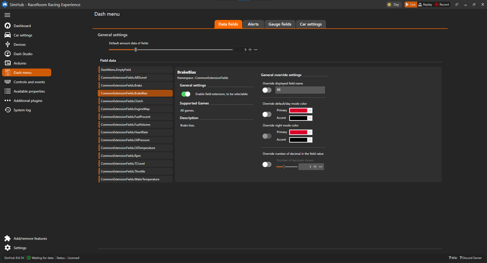

# Data field settings

## Enable

The field data extension can be enabled to make it selectable or disabled to reduce the number of selectable fields.

## Override

You can override some of the default behavior of the field.

### Name

Override the displayed name of the field data.

### Color

Simhub includes a built-in function for day/night settings, allowing you to configure a color scheme for both day and night. This ensures that the field colors change appropriately with the day/night mode.

#### Day Night mode

Simhub includes a built-in function for day/night settings, allowing you to configure a color scheme for both day and night. This ensures that the field colors change appropriately with the day/night mode.

## Decimal

If the field value is a decimal number, you can adjust the number of decimal places displayed. This setting is only visible if the field value can be a decimal number.
