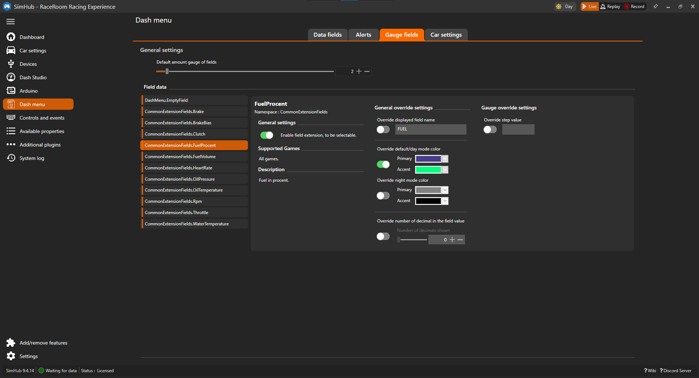

# Gauge field settings

Gauge field have the same settings as [Data fields](DataFieldSettings.md) and more. there will only be listed the settings that are specific for gauge fields. For the other settings check the [Data field settings](DataFieldSettings.md).

## Override

### Maximum/minimum value

If the range is not lock it's possible to change the maximum or minimum value.

### Step value

If the step value is not lock it's possible to change the step value.
