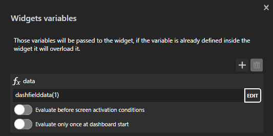
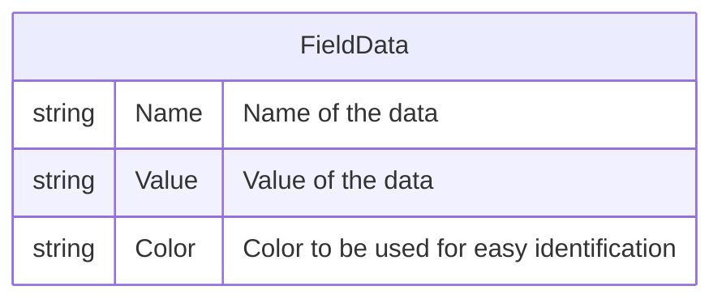
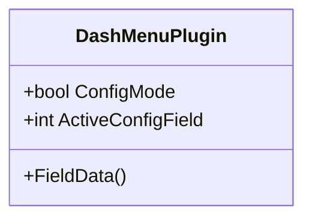

# Dash menu

This plugin allows you to create and display customizable data fields on the dashboard. These fields are easy to change, even during a race, eliminating the need for multiple dashboards for different car types.

## Install plugin

To install the plugin:

1. Download the DLL file.
2. Paste the DLL file into the root directory of Simhub: `C:\Program Files (x86)\SimHub`.

## Install Data fields

This plugin uses a flexible and expandable approach similar to Simhub for plugins. To add additional fields:

1. Create a folder named `DashMenuCustomFields` in the root directory of Simhub.
2. Place any additional dash menu data field DLL files into this folder.

The DLL files placed in this folder will be loaded when starting Simhub.

## Configure Control Mapping

After installing the plugin and additional data fields, you need to configure the control mapping to manage actions. This is done in the "Controls and Events" menu.

1. Select the "Controls and Events" menu.
2. Navigate to the "Controls" tab.
3. Click on "New mapping".
4. Search for the action.
5. Assign a button.

Repeat step 3 to 5 for all required actions.

Available Actions:

|Name| Required | Description|
| --- | :---: | --- |
| `ToggleConfigMode` | :heavy_check_mark: | Toggle configuration mode |
| `ConfigNextField` | :heavy_check_mark: | Select next field when in configuration mode |
| `ConfigPrevField` | :heavy_check_mark: | Select previous field when in configuration mode |
| `ChangeFieldTypeNext` | :heavy_check_mark: | Change field type of the selected field when in configuration mode |
| `ChangeFieldTypePrev` | :heavy_check_mark: | Change field type of the selected field when in configuration mode |

## Using in Dashboard

In Dash Studio the field can be accessed with the NCalc/Java script function/method `dashfielddata(fieldnumber)`. Unfortunately it can't be found in the NCalc Functions list :unamused: but it's available :sunglasses:!
The easiest way is to create a widget and pass the field data as a variable.

To display the values of the field data in a widget, use these JavaScript code snippets for the binding property:

* `return $prop("variable.data").Name`
* `return $prop("variable.data").Value`
* `return $prop("variable.data").Color`

### Config screen

It's possible to make a configuration screen by using the the following properties:

* `ConfigMode`
* `ActiveConfigField`

`ConfigMode` is true when it's possible to navigate and change the configuration of the displayed fields.

`ActiveConfigField` is the current index of the displayed field that can be changed.

Changes are automatically saved, and it is not possible to undo changes to the configuration except by manually reverting the changes yourself.

## FieldData class structure

## Future features

* [ ] Enabled and disable data fields, that can be selected.
* [ ] Make it possible to overwrite name and color of a field.
* [ ] Sort the data fields to make cycling through them easier.
