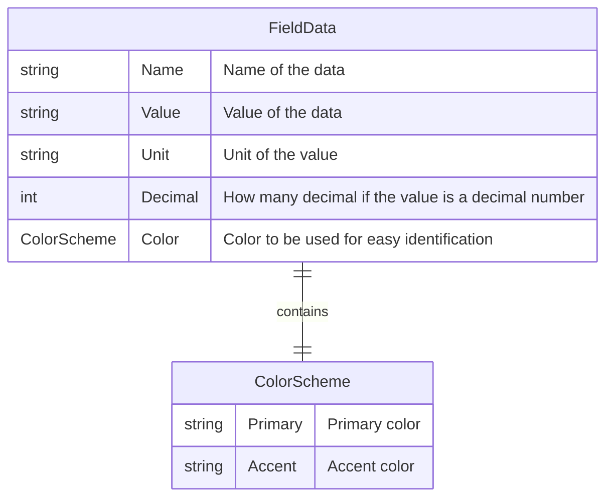
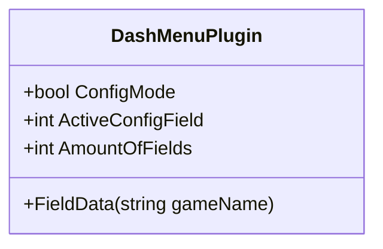

# Dash menu

This plugin allows you to create and display customizable data fields on the dashboard. These fields are easy to change, even during a race, eliminating the need for multiple dashboards for different car types.

*Demo of the testing dashboard found in the [repo](./Dash%20menu%20test.simhubdash).*

## Using

When using a car for the first time, a default number of empty fields will be created. These fields can then be adjusted to display the relevant data for the car. The number of fields can also be changed as needed.

When using a car that has already been set up, it will use the latest settings for that car.

## Install plugin

To install the plugin:

1. Download the DLL file.
2. Paste the DLL file into the root directory of Simhub: `C:\Program Files (x86)\SimHub`.

## Install Data fields

This plugin uses a flexible and expandable approach similar to Simhub for plugins. To add additional fields:

1. Create a folder named `DashMenuCustomFields` in the root directory of Simhub.
2. Place any additional dash menu data field DLL files into this folder.

The DLL files placed in this folder will be loaded when starting Simhub.

## Configure Control Mapping

After installing the plugin and additional data fields, you need to configure the control mapping to manage actions. This is done in the "Controls and Events" menu.

1. Select the "Controls and Events" menu.
2. Navigate to the "Controls" tab.
3. Click on "New mapping".
4. Search for the action.
5. Assign a button.

Repeat step 3 to 5 for all required actions.

Available Actions:

|Name| Required | Description|
| --- | :---: | --- |
| `ToggleConfigMode` | :heavy_check_mark: | Toggle configuration mode |
| `ConfigNextField` | :heavy_check_mark: | Select next field when in configuration mode |
| `ConfigPrevField` | :heavy_check_mark: | Select previous field when in configuration mode |
| `ChangeFieldTypeNext` | :heavy_check_mark: | Change field type of the selected field when in configuration mode |
| `ChangeFieldTypePrev` | :heavy_check_mark: | Change field type of the selected field when in configuration mode |
| `IncreaseNumberOfFieldData` | :x: | Increase number of fields for the current car (maximum 20) |
| `DecreaseNumberOfFieldData` | :x: | Decrease number of fields for the current car (minimum 1) |

## Using in Dashboard

In Dash Studio the field can be accessed with the NCalc/JavaScript function/method `dashfielddata(fieldnumber)`. Unfortunately it can't be found in the NCalc Functions list :unamused: but it's available :sunglasses:!
The easiest way is to create a widget and pass the field data as a variable.

To get the number of fields for the current car, use the property `AmountOfFields`.

To display the values of the field data in a widget, use these JavaScript code snippets for the binding property:

* `return $prop("variable.data").Name`
* `return $prop("variable.data").Value`
* `return $prop("variable.data).Unit`
* `return $prop("variable.data").Color.Primary`
* `return $prop("variable.data").Color.Accent`

### Config screen

It's possible to make a configuration screen by using the the following properties:

* `ConfigMode`
* `ActiveConfigField`

`ConfigMode` is true when it's possible to navigate and change the configuration of the displayed fields.

`ActiveConfigField` is the current index of the displayed field that can be changed.

Changes are automatically saved, and it is not possible to undo changes to the configuration except by manually reverting the changes yourself.

## Change amount of fields

In the General settings tab, you can adjust the default amount of fields to use when setting up a new car. You can choose any number between 1 and 20.

You can change the number of fields for the current car by assigning the `IncreaseNumberOfFieldData` and `DecreaseNumberOfFieldData` actions. When using a new car, the fields will be created with the default number of fields.

## Configuring Fields

You can change or configure various settings for the fields.

### General settings

#### Enable

The field data extension can be enabled to make it selectable or disabled to reduce the number of selectable fields.

### Override

You can override some of the default behavior of the field.

#### Name

Override the displayed name of the field data.

#### Color

Simhub includes a built-in function for day/night settings, allowing you to configure a color scheme for both day and night. This ensures that the field colors change appropriately with the day/night mode.

##### Day Night mode

Simhub includes a built-in function for day/night settings, allowing you to configure a color scheme for both day and night. This ensures that the field colors change appropriately with the day/night mode.

### Decimal

If the field value is a decimal number, you can adjust the number of decimal places displayed. This setting is only visible if the field value can be a decimal number.

## FieldData class structure

## Future features

* [ ] Sort the data fields to make cycling through them easier.
* [ ] Add extension for gauges.
