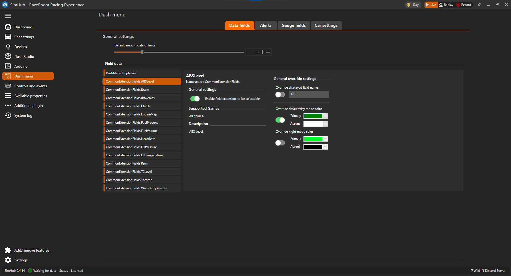

# Dash menu

This plugin allows you to create and display customizable data fields on the dashboard. These fields are easy to change, even during a race, eliminating the need for multiple dashboards for different car types.

*Demo of the testing dashboard found in the [repo](./Dash%20menu%20test.simhubdash).*

**This plugin is still a work in progress** and a changes to the implementation of field and UI can happen.

> [!CAUTION]
> Known issue :bug:
>
> After using new fields for the first time for a game. Simhub needs to be restarted for the settings to work properly.

## Using

When using a car for the first time, a default number of empty fields will be created. These fields can then be adjusted to display the relevant data for the car. It is also possible to set a default set of field that will be used instead of the empty fields. The number of fields can also be changed as needed.

When using a car that has already been set up, it will use the latest settings for that car.

## Install plugin

To install the plugin:

1. Download the newest [DashMenu.dll file](https://github.com/SCarlsen7757/SimhubDashMenuPlugin/releases).
2. Paste the DLL file into the root directory of Simhub: `C:\Program Files (x86)\SimHub`.

## Install Data fields

This plugin supports an expandable approach, similar to Simhub plugins, for adding more extension fields:

1. Create a folder named `DashMenuExtensionFields` in the root directory of Simhub.
2. Place any additional dash menu extension field DLL files into this folder.

The DLL files placed in this folder will be loaded when starting Simhub.

To get started you can use this [CommonExtensionFields.dll](https://github.com/SCarlsen7757/SimhubDashMenuPlugin/releases) file.

## Configure Control Mapping

After installing the plugin and additional data fields, you need to configure the control mapping to manage actions. This is done in the "Controls and Events" menu.

1. Select the "Controls and Events" menu.
2. Navigate to the "Controls" tab.
3. Select 'New mapping', search for the action, and assign a button.

Repeat step 3 for all required actions.

Available Actions:

|Name| Required | Description|
| --- | :---: | --- |
| `ToggleConfigMode` | :heavy_check_mark: | Toggle configuration mode |
| `ChangeFieldType` | :x: | Change field type for configuration mode ( Change between Data field and Gauge fields) |
| `ConfigNextField` | :heavy_check_mark: | Select next field when in configuration mode |
| `ConfigPrevField` | :heavy_check_mark: | Select previous field when in configuration mode |
| `ChangeFieldTypeNext` | :heavy_check_mark: | Change field type of the selected field when in configuration mode |
| `ChangeFieldTypePrev` | :heavy_check_mark: | Change field type of the selected field when in configuration mode |
| `IncreaseNumberOfField` | :x: | Increase number of fields for the current car (maximum 20) |
| `DecreaseNumberOfField` | :x: | Decrease number of fields for the current car (minimum 1) |

After installing the plugin and extension fields, mapping of required controls to configure various in-game actions, you are good to go and use dashboard that implement this plugin.

## Using in Dashboard

### Data field

You can access the fields in Dash Studio using the NCalc or JavaScript function `dashfielddata(fieldnumber)`. It can be found in the function NCalc Functions list :sunglasses:
You can access all the fields properties within Dash Studio using the NCalc functions. See the table below.

|Function|Syntax|Description|
|---|---|---|
|`dashfielddataname`|`index`|Returns the name of the data field of the specified field.|
|`dashfielddatavalue`|`index`|Returns the value of the data field of the specified field.|
|`dashfielddatadecimal`|`index`|Returns the number of decimals the value has of the data field of the specified field.|
|`dashfielddataunit`|`index`|Returns the unit of the data field of the specified field.|
|`dashfielddatacolorprimary`|`index`|Returns the primary color of the data field of the specified field.|
|`dashfielddatacoloraccent`|`index`|Returns the accent color of the data field of the specified field.|

Example how to get the name of the first data field.

To get the number of data fields for the current car, use the property `AmountOfDataFields`.

### Gauge field

The gauge field same properties as the [Data field](#data-field) and more, the gauge field is intended to be used with linear or circular gauges.
You can access all the fields properties within Dash Studio using NCalc functions. See the table below.

|Function|Syntax|Description|
|---|---|---|
|`dashfieldgaugename`|`index`|Return the name of the gauge field of the specified field.|
|`dashfieldgaugevalue`|`index`|Return the value of the gauge field of the specified field.|
|`dashfieldgaugedecimal`|`index`|Returns the number of decimals the value has of the gauge field of the specified field.|
|`dashfieldgaugeunit`|`index`|Return the unit of the gauge field of the specified field.|
|`dashfieldgaugemaximum`|`index`|Return the maximum value of the gauge field of the specified field.|
|`dashfieldgaugeminimum`|`index`|Return the minimum value of the gauge field of the specified field.|
|`dashfieldgaugestep`|`index`|Return the step value of the gauge field of the specified field.|
|`dashfieldgaugecolorprimary`|`index`|Return the primary color of the gauge field of the specified field.|
|`dashfieldgaugecoloraccent`|`index`|Return the accent color of the gauge field of the specified field.|

Example how to get the value and unit of the first gauge field.

To get the number of data fields for the current car, use the property `AmountOfGaugeFields`.

### Config screen

It's possible to make a configuration screen by using the the following properties:

* `ConfigMode`
* `ActiveConfigField`
* `FieldType`

`ConfigMode` is true when it's possible to navigate and change the configuration of the displayed fields.

`ActiveConfigField` is the current index of the displayed field that can be changed.

`FieldType` is the type of field that is in configuration mode. It can have the value `Data` or `Gauge`.

Changes are automatically saved, and it is not possible to undo changes to the configuration except by manually reverting the changes yourself.

## Change amount of fields

In the Dash field and Gauge field tab, you can adjust the default amount of fields to use when setting up a new car. You can choose any number between 1 and 20.

You can change the number of fields for the current car by assigning the `IncreaseNumberOfField` and `DecreaseNumberOfField` actions. When using a new car, the fields will be created with the default number of fields or the default set of fields. When increasing the number of fields, the new field will be added at the end, and existing fields will remain unchanged. When decreasing the number of fields, the last field will be removed. The other fields won't be affected.

## Configuring Fields

You can change or configure various settings for the fields.

### Data field settings

#### Enable

The field data extension can be enabled to make it selectable or disabled to reduce the number of selectable fields.

### Override

You can override some of the default behavior of the field.

#### Name

Override the displayed name of the field data.

#### Color

Simhub includes a built-in function for day/night settings, allowing you to configure a color scheme for both day and night. This ensures that the field colors change appropriately with the day/night mode.

##### Day Night mode

Simhub includes a built-in function for day/night settings, allowing you to configure a color scheme for both day and night. This ensures that the field colors change appropriately with the day/night mode.

### Decimal

If the field value is a decimal number, you can adjust the number of decimal places displayed. This setting is only visible if the field value can be a decimal number.

## Future features

* [ ] Sort the data fields to make cycling through them easier.

## Attributions

* <a href="https://www.flaticon.com/free-icons/car-indicator" title="car indicator icons">Car indicator icons created by verluk - Flaticon</a>
* <a href="https://www.flaticon.com/free-icons/dots" title="dots icons">Dots icons created by meaicon - Flaticon</a>
* <a href="https://www.flaticon.com/free-icons/wiper" title="wiper icons">Wiper icons created by TravisAvery - Flaticon</a>
* <a href="https://www.flaticon.com/free-icons/lighting" title="lighting icons">Lighting icons created by muhammad atho' - Flaticon</a>